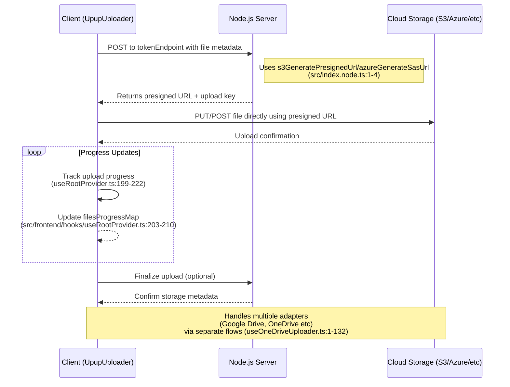

# upup

Upup is an open-source, free-to-use **Full-stack library** that easily handles your file upload needs with seamless DigitalOcean Spaces, Amazon S3, Backblaze, Microsoft Azure Blob Storage, Google Drive, and OneDrive integrations.

🎮 Join our Discord, where we can provide quick support: [Discord Invite Link](https://discord.gg/ny5WUE9ayc)


---

## Installation

Install upup with your favourite package manager

### npm

```bash
npm install @bassem97/upup
```

### yarn

```bash
yarn add @bassem97/upup
```

### pnpm

```bash
pnpm add @bassem97/upup
```

### bun

```bash
bun install @bassem97/upup
```

## Logic Diagram

This logic diagram explains how the client and server parts of the upup package works



## Usage

The example below shows a minimal configuration for AWS S3 upload, using the [UpupUploader](https://upup-landing-page.vercel.app/docs/category/upupuploader) client component and the [`s3GeneratePresignedUrl`](https://upup-landing-page.vercel.app/docs/api-reference/s3-generate-presigned-url) utility. For full code examples check these [docs](https://upup-landing-page.vercel.app/docs/code-examples)

### Client Side

```tsx
import { UpupUploader, UpupProvider } from '@bassem97/upup'

export default function Uploader() {
    return (
        <UpupUploader
            provider={UpupProvider.AWS} // assuming we are uploading to AWS
            tokenEndpoint="http://<path_to_your_server>/api/upload-token" // Path to your server route that calls our exported upload utilities
        />
    )
}
```

:::note

The [`UpupUploader`](https://upup-landing-page.vercel.app/docs/category/upupuploader) must be placed in a client component.

:::

Then use it in your application:

```tsx
import Uploader from '<path_to_your_uploader_component>'

export default function App() {
    return <Uploader />
}
```

:::info

[`provider`](https://upup-landing-page.vercel.app/docs/api-reference/upupuploader/required-props#provider) and [`tokenEndpoint`](https://upup-landing-page.vercel.app/docs/api-reference/upupuploader/required-props#tokenendpoint) are the only required props for the UpupUploader component. For a full list of component props, check out these [docs](https://upup-landing-page.vercel.app/docs/category/upupuploader).

:::

### Server Side

```ts
import { s3GeneratePresignedUrl } from '@bassem97/upup/server'

app.post('/api/upload-token', async (req, res) => {
    try {
        const { provider, ...fileParams } = req.body // The request body sent from the `UpupUploader` client component
        const origin = req.headers['origin'] // The origin of your client application

        // Generate presigned URL
        const presignedData = await s3GeneratePresignedUrl({
            origin: origin as string,
            provider,
            fileParams,
            bucketName: process.env.AWS_BUCKET_NAME as string,
            s3ClientConfig: {
                region: process.env.AWS_REGION as string,
                credentials: {
                    accessKeyId: process.env.AWS_ACCESS_KEY_ID as string,
                    secretAccessKey: process.env
                        .AWS_SECRET_ACCESS_KEY as string,
                },
            },
        })

        return res.status(200).json({
            data: presignedData,
            message: 'Upload successful!',
            error: false,
        })
    } catch (error) {
        return res.status(500).json({
            message: (error as Error).message,
            error: true,
        })
    }
})
```

Once again, the example shown above is the minimal required configuration for AWS S3 upload. For uploading to other services see these [docs](https://upup-landing-page.vercel.app/docs/code-examples)

### Important Note

It is important to note that while it is possible to:

-   Implement your own custom logic on the client and use the server utilities provided by this component on the server OR
-   Use the `UpupUploader` React component on the client and implement your own custom server logic to handle uploads,

For best performance and minimal overhead, we advise that you use both the [`UpupUploader`](https://upup-landing-page.vercel.app/docs/category/upupuploader) React component together with the server utilities, like [`s3GeneratePresignedUrl`](https://upup-landing-page.vercel.app/docs/api-reference/s3-generate-presigned-url)

The full list of exported server utility functions include:

-   [`s3GeneratePresignedUrl`](https://upup-landing-page.vercel.app/docs/api-reference/s3-generate-presigned-url): for S3-compatible Uploads: like AWS, Digital Ocean, Backblaze
-   [`azureGenerateSasUrl`](https://upup-landing-page.vercel.app/docs/api-reference/azure-generate-sas-url): for Azure Blob Uploads only

:::info

For a full list of values sent by the React component to the server, check out these [docs](https://upup-landing-page.vercel.app/docs/api-reference/upupuploader/required-props#tokenendpoint).

:::

## All done! 🎉

### Contributing

Please read our [Contributing Guidelines](CONTRIBUTING) before submitting pull requests. All contributions fall under our [Code of Conduct](CODE_OF_CONDUCT).

### Security

For security concerns, please review our [Security Policy](SECURITY).

### License

This project is licensed under the MIT License - see the [LICENSE](LICENSE) file for details.

---

Made with ❤️ by [Devino](https://devino.ca/)
