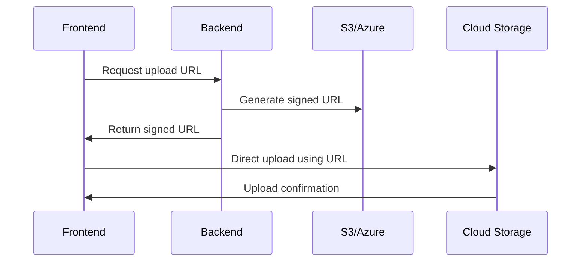

# `s3GeneratePresignedUrl`

This server-side utility generates secure presigned URLs for direct S3 uploads from the [`UpupUploader`](/docs/category/upupuploader) component. Compatible with AWS S3 and other S3-compatible storage providers.

## Parameters

It has a single parameter. An object with the following key values:

| Parameter                                       | Type                                                                        | Status   | Default Value |
| ----------------------------------------------- | --------------------------------------------------------------------------- | -------- | ------------- |
| [`bucketName`](#bucketname)                     | string                                                                      | required | N/A           |
| [`expiresIn`](#expiresin)                       | number                                                                      | optional | 3600          |
| [`fileParams`](#fileparams)                     | object                                                                      | required | N/A           |
| [`origin`](#origin)                             | string                                                                      | required | N/A           |
| [`provider`](#provider)                         | [UpupProvider](/docs/api-reference/upupuploader/required-props.md#provider) | required | N/A           |
| [`customProps`](#customprops)                   | object                                                                      | optional | undefined     |
| [`enableAutoCorsConfig`](#enableautocorsconfig) | boolean                                                                     | optional | `false`       |
| [`s3ClientConfig`](#s3clientconfig)             | object                                                                      | required | N/A           |

### `bucketName`

Name of the S3 bucket for file storage.

### `expiresIn`

Presigned url validity duration in seconds. Defaults to 1 hour (3600 seconds).

<!-- :::tip
Not sure of how the upup package works, take a look at this [logic diagram](/docs/getting-started.md#logic-diagram) or the simplified version below:



::: -->

### `fileParams`

Specifies file metadata and validation rules passed from the client in the request body.

```ts
export interface FileParams {
  // These values are unique to each file
  name: string; // Original filename
  type: string; // MIME type
  size: number; // File size in bytes

  // These values are based on the UpupUploader props
  accept?: string; // Allowed file types
  maxFileSize?: number; // Max size in bytes
  multiple?: boolean; // Multiple files allowed
}
```

### `origin`

This refers to the client application origin that the client component is installed and running on.
This value must be supplied by the user to properly configure the CORS permissions of the S3 bucket.

:::note
Asides from the CORS permission of the S3 bucket, your server must configure CORS (Cross-Origin Resource Sharing) to explicitly allow requests from your client application's origin. This is required because the browser blocks cross-origin requests by default.

Here's a basic Express server configuration example:

```javascript
import express from "express";
import cors from "cors";

const app = express();

// Configure CORS middleware
app.use(
  cors({
    origin: process.env.CLIENT_ORIGIN || "http://localhost:3000", // Your client's origin
    methods: ["POST"], // Only allow required methods
    allowedHeaders: ["Content-Type", "Authorization"], // Exact headers might vary based on your server setup
    credentials: true,
  })
);

// Your token endpoint handler
app.post("/api/upload-token", (req, res) => {
  // Call `s3GeneratePresignedUrl` here
});
```

:::

### `provider`

Read more about this [here](/docs/api-reference/upupuploader/required-props.md#provider)
This is passed from the client in the request body.

### `customProps`

Read more about this [here](/docs/api-reference/upupuploader/optional-props.md#customprops)
This is passed from the client in the request body.

### `enableAutoCorsConfig`

Read more about this [here](/docs/api-reference/upupuploader/optional-props.md#enableautocorsconfig)
This is passed from the client in the request body.

### `s3ClientConfig`

This object refers to the AWS credentials of the user or server application.
It has the following properties:

```ts
{
    region: string; // Storage region
    credentials: {
        accessKeyId: string; // IAM access key
        secretAccessKey: string; // IAM secret key
    };
    endpoint?: string; // Required only for non-AWS providers. In this format: https://...
    forcePathStyle?: boolean; // Required only for non-AWS providers
}
```

## Response Structure

```ts
interface PresignedUrlResponse {
  key; // unique S3 bucket identifier for the uploaded file
  publicUrl; // signed url to view the uploaded file
  uploadUrl; // url for the client application to upload the file to
  expiresIn; // Presigned url validity duration in seconds
}
```

## Security Implementation

1. **Temporary Credentials**  
   Generates time-limited upload URLs using IAM credentials

   ```mermaid
   sequenceDiagram
       Frontend->>Backend: Request upload URL
       Backend->>S3: Generate presigned URL
       S3->>Backend: Return signed URL
       Backend->>Frontend: Return upload data
   ```

2. **Validation**
   - File size and type checks
   - Unique object keys using UUIDs
   - HTTPS protocol enforcement

:::warning Security Best Practices

1. Use IAM roles with least privilege
2. Rotate access keys regularly
3. Set minimum required permissions for teh access keys
4. Store credentials in environment variables as such:

```ts
const { provider, customProps, ...fileParams } = req.body;

s3GeneratePresignedUrl({
  origin: origin as string,
  provider,
  fileParams,
  bucketName: process.env.BACKBLAZE_BUCKET_NAME!,
  s3ClientConfig: {
    region: process.env.BACKBLAZE_BUCKET_REGION,
    credentials: {
      accessKeyId: process.env.BACKBLAZE_KEY_ID!,
      secretAccessKey: process.env.BACKBLAZE_APP_KEY!,
    },
    endpoint: process.env.BACKBLAZE_S3_ENDPOINT, // In this format: https://...
    forcePathStyle: false,
  },
});
```

:::

:::tip
Check our [code examples](/docs/code-examples.md) for how to configure `s3GeneratePresignedUrl` for your particular back-end stack, and how to [configure your credentials with the right permissions](/docs/credentials-configuration.md)
:::
