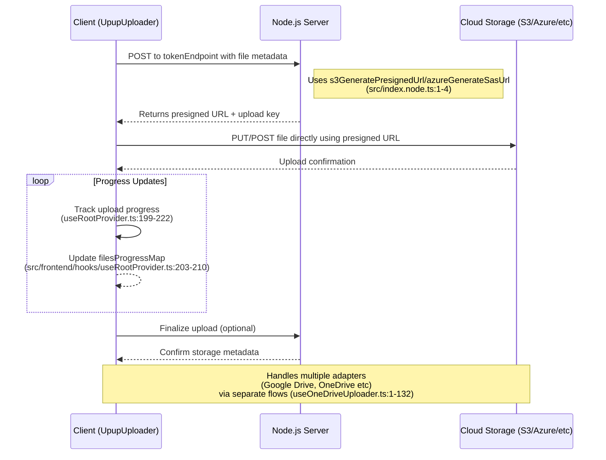

# Getting Started

Upup is an open-source, free-to-use **Full-stack library** that easily handles your file upload needs with seamless DigitalOcean Spaces, Amazon S3, Backblaze, Microsoft Azure Blob Storage, Google Drive, and OneDrive integrations.

## Installation

Install upup with your favourite package manager

### npm

```bash
npm install upup-react-file-uploader
```

### yarn

```bash
yarn add upup-react-file-uploader
```

### pnpm

```bash
pnpm add upup-react-file-uploader
```

### bun

```bash
bun install upup-react-file-uploader
```

## Logic Diagram

This logic diagram explains how the client and server parts of the upup package works



## Usage

The example below shows a minimal configuration for AWS S3 upload, using the [UpupUploader](/docs/category/upupuploader) client component and the [`s3GeneratePresignedUrl`](/docs/api-reference/s3-generate-presigned-url.md) utility. For full code examples check these [docs](/docs/code-examples.md)

### Client Side

```tsx
import { UpupUploader, UpupProvider } from "upup-react-file-uploader";
import 'upup-react-file-uploader/styles'

export default function Uploader() {
  return (
    <UpupUploader
      provider={UpupProvider.AWS} // assuming we are uploading to AWS
      tokenEndpoint="http://<path_to_your_server>/api/upload-token" // Path to your server route that calls our exported upload utilities
    />
  );
}
```

:::note

The [`UpupUploader`](/docs/category/upupuploader) must be placed in a client component. i.e For Next.js add the `use client` directive at the top of the example `Uploader` component

:::

Then use it in your application:

```tsx
import Uploader from "<path_to_your_uploader_component>";

export default function App() {
  return <Uploader />;
}
```

:::info

[`provider`](/docs/api-reference/upupuploader/required-props.md#provider) and [`tokenEndpoint`](/docs/api-reference/upupuploader/required-props.md#tokenendpoint) are the only required props for the UpupUploader component. For a full list of component props, check out these [docs](/docs/category/upupuploader).

:::

### Server Side

:::warning

The example below is the minimal required configuration for **AWS** S3 upload. For uploading to other services see these [docs](/docs/code-examples.md)
:::

:::tip CORS Configuration
For the upload to work without errors, it is important to:

1. Manually configure CORS using our [credentials guide](/docs/credentials-configuration.md#server-side-configurations), OR
2. Enabling `enableAutoCorsConfig` with properly restricted credentials
:::

```ts
import { s3GeneratePresignedUrl } from "upup-react-file-uploader/server";

app.post("/api/upload-token", async (req, res) => {
  try {
    const { provider, customProps, enableAutoCorsConfig, ...fileParams } =
      req.body; // The request body sent from the `UpupUploader` client component
    const origin = req.headers["origin"]; // The origin of your client application

    // Generate presigned URL
    const presignedData = await s3GeneratePresignedUrl({
      origin: origin as string,
      provider,
      fileParams,
      bucketName: process.env.AWS_BUCKET_NAME as string,
      s3ClientConfig: {
        region: process.env.AWS_REGION as string,
        credentials: {
          accessKeyId: process.env.AWS_ACCESS_KEY_ID as string,
          secretAccessKey: process.env.AWS_SECRET_ACCESS_KEY as string,
        },
      },
      enableAutoCorsConfig,
    });

    return res.status(200).json({
      data: presignedData,
      message: "Upload successful!",
      error: false,
    });
  } catch (error) {
    return res.status(500).json({
      message: (error as Error).message,
      error: true,
    });
  }
});
```

### Important Note

It is important to note that while it is possible to:

- Implement your own custom logic on the client and use the server utilities provided by this component on the server OR
- Use the `UpupUploader` React component on the client and implement your own custom server logic to handle uploads,

For best performance and minimal overhead, we advise that you use both the [`UpupUploader`](/docs/category/upupuploader) React component together with the server utilities, like [`s3GeneratePresignedUrl`](/docs/api-reference/s3-generate-presigned-url.md)

The full list of exported server utility functions include:

- [`s3GeneratePresignedUrl`](/docs/api-reference/s3-generate-presigned-url.md): for S3-compatible Uploads: like AWS, Digital Ocean, Backblaze
- [`azureGenerateSasUrl`](/docs/api-reference/azure-generate-sas-url.md): for Azure Blob Uploads only

:::info

For a full list of values sent by the React component to the server, check out these [docs](/docs/api-reference/upupuploader/required-props.md#tokenendpoint).

:::

## Advanced Usage

### Programmatic Control

For more advanced use cases, you can control the upload process programmatically using the component's [ref API](/docs/api-reference/upupuploader/ref-api.md)
