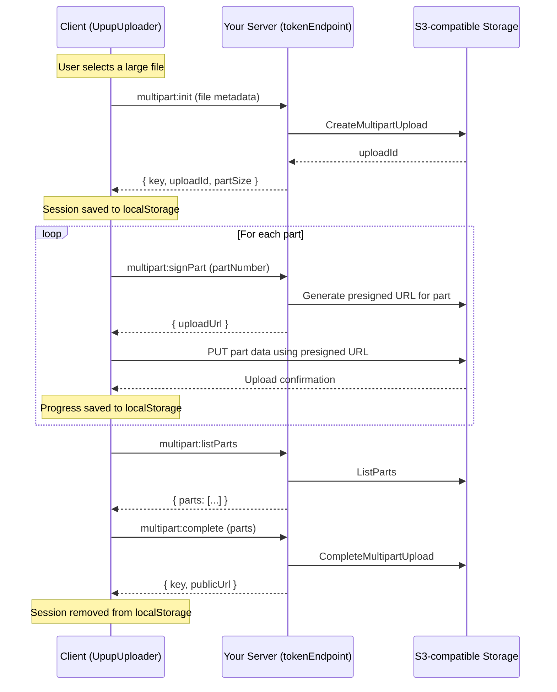

# Resumable Uploads

Resumable uploads allow large files to be uploaded in smaller parts (chunks), with the ability to **pause**, **resume**, and **recover** uploads after network failures or page refreshes. This feature uses S3 multipart upload under the hood and is available for all S3-compatible providers (AWS, BackBlaze, DigitalOcean).

:::info
Resumable uploads are **not supported** for Azure Blob Storage. Azure uploads always use a single PUT request.
:::

## How It Works



### Resume After Refresh

When a user refreshes the page and re-selects the same file:

1. The client recognizes the file via a deterministic **fingerprint** (`name + size + lastModified + type`)
2. It loads the saved session from `localStorage` (key, uploadId, partSize, bytes uploaded)
3. It queries S3 for already-uploaded parts via `multipart:listParts`
4. It **skips** completed parts and continues from where it left off
5. The progress bar immediately jumps to the resume point

If the session is stale (e.g., the multipart upload expired on S3), the client transparently starts a fresh upload with no user interaction required.

### Pause & Resume

During an active upload, users can:

- **Pause** — Blocks between part uploads (the current in-flight part completes, then upload halts)
- **Resume** — Continues uploading from the next pending part

Pausing works at the part boundary rather than mid-XHR to avoid issues with presigned URL expiration.

## Client Setup

Add the `resumable` prop to your `UpupUploader` component:

```tsx
import { UpupUploader, UpupProvider } from "upup-react-file-uploader";
import "upup-react-file-uploader/styles";

export default function Uploader() {
  return (
    <UpupUploader
      provider={UpupProvider.AWS}
      tokenEndpoint="/api/upload-token"
      resumable={{ mode: "multipart" }}
    />
  );
}
```

### Configuration Options

```typescript
type ResumableUploadOptions = {
  mode: "multipart";
  /** Part size in bytes. Minimum 5 MiB, clamped automatically. */
  chunkSizeBytes?: number;
  /** Persist upload sessions in localStorage for cross-refresh resume. Default: true */
  persist?: boolean;
};
```

| Option           | Type    | Default | Description                                                                                                                        |
| ---------------- | ------- | ------- | ---------------------------------------------------------------------------------------------------------------------------------- |
| `mode`           | string  | -       | Must be `"multipart"`. (`"tus"` is reserved for future use.)                                                                       |
| `chunkSizeBytes` | number  | auto    | Override the part size. Minimum 5 MiB. If omitted, part size is computed automatically based on file size (max 10,000 parts).      |
| `persist`        | boolean | `true`  | When `true`, upload sessions are saved to `localStorage` so uploads survive page refreshes. Set to `false` to disable persistence. |

For more details on the `resumable` prop, see the [optional props reference](/docs/api-reference/upupuploader/optional-props.md#resumable).

## Server Setup

Your `tokenEndpoint` must handle **six actions** — the original presigned URL action (no `action` field) plus five multipart actions. The request body includes an `action` field that your server should switch on.

### Required Server Utilities

Import the multipart utilities from the server package:

```typescript
import {
  s3GeneratePresignedUrl,
  s3InitiateMultipartUpload,
  s3GeneratePresignedPartUrl,
  s3ListMultipartParts,
  s3CompleteMultipartUpload,
  s3AbortMultipartUpload,
} from "upup-react-file-uploader/server";
```

### Next.js App Router Example

```typescript
import { NextRequest, NextResponse } from "next/server";
import {
  s3GeneratePresignedUrl,
  s3InitiateMultipartUpload,
  s3GeneratePresignedPartUrl,
  s3ListMultipartParts,
  s3CompleteMultipartUpload,
  s3AbortMultipartUpload,
} from "upup-react-file-uploader/server";

function getS3Config(req: NextRequest) {
  return {
    origin: req.headers.get("origin") ?? "",
    bucketName: process.env.S3_BUCKET!,
    s3ClientConfig: {
      region: process.env.S3_REGION!,
      endpoint: process.env.S3_ENDPOINT!, // Only for non-AWS providers
      credentials: {
        accessKeyId: process.env.S3_KEY_ID!,
        secretAccessKey: process.env.S3_SECRET!,
      },
    },
  };
}

export async function POST(req: NextRequest) {
  try {
    const body = await req.json();
    const { action, provider, enableAutoCorsConfig } = body;
    const s3Config = getS3Config(req);

    // Legacy single-upload path (no action field)
    if (!action) {
      const { provider: _p, enableAutoCorsConfig: _e, ...fileParams } = body;
      const presigned = await s3GeneratePresignedUrl({
        ...s3Config,
        provider,
        fileParams,
        enableAutoCorsConfig,
      });
      return NextResponse.json(presigned, { status: 200 });
    }

    switch (action) {
      case "multipart:init": {
        const {
          name,
          type,
          size,
          accept,
          maxFileSize,
          multiple,
          chunkSizeBytes,
        } = body;
        const result = await s3InitiateMultipartUpload({
          ...s3Config,
          provider,
          enableAutoCorsConfig,
          fileParams: { name, type, size, accept, maxFileSize, multiple },
          chunkSizeBytes,
        });
        return NextResponse.json(result, { status: 200 });
      }

      case "multipart:signPart": {
        const { key, uploadId, partNumber, contentLength } = body;
        const result = await s3GeneratePresignedPartUrl({
          ...s3Config,
          provider,
          key,
          uploadId,
          partNumber,
          contentLength,
        });
        return NextResponse.json(result, { status: 200 });
      }

      case "multipart:listParts": {
        const { key, uploadId } = body;
        const result = await s3ListMultipartParts({
          ...s3Config,
          provider,
          key,
          uploadId,
        });
        return NextResponse.json(result, { status: 200 });
      }

      case "multipart:complete": {
        const { key, uploadId, parts } = body;
        const result = await s3CompleteMultipartUpload({
          ...s3Config,
          provider,
          key,
          uploadId,
          parts,
        });
        return NextResponse.json(result, { status: 200 });
      }

      case "multipart:abort": {
        const { key, uploadId } = body;
        const result = await s3AbortMultipartUpload({
          ...s3Config,
          provider,
          key,
          uploadId,
        });
        return NextResponse.json(result, { status: 200 });
      }

      default:
        return NextResponse.json(
          { details: `Unknown action: ${action}` },
          { status: 400 },
        );
    }
  } catch (error) {
    return NextResponse.json(
      { details: (error as Error).message },
      { status: 500 },
    );
  }
}
```

### Express.js Example

```typescript
import express from "express";
import {
  s3GeneratePresignedUrl,
  s3InitiateMultipartUpload,
  s3GeneratePresignedPartUrl,
  s3ListMultipartParts,
  s3CompleteMultipartUpload,
  s3AbortMultipartUpload,
} from "upup-react-file-uploader/server";

const app = express();
app.use(express.json());

const getS3Config = (req: express.Request) => ({
  origin: req.headers.origin as string,
  bucketName: process.env.S3_BUCKET!,
  s3ClientConfig: {
    region: process.env.S3_REGION!,
    credentials: {
      accessKeyId: process.env.S3_KEY_ID!,
      secretAccessKey: process.env.S3_SECRET!,
    },
    endpoint: process.env.S3_ENDPOINT, // Only for non-AWS providers
  },
});

app.post("/api/upload-token", async (req, res) => {
  try {
    const { action, provider, enableAutoCorsConfig } = req.body;
    const s3Config = getS3Config(req);

    if (!action) {
      const {
        provider: _p,
        enableAutoCorsConfig: _e,
        ...fileParams
      } = req.body;
      const presigned = await s3GeneratePresignedUrl({
        ...s3Config,
        provider,
        fileParams,
        enableAutoCorsConfig,
      });
      return res.status(200).json(presigned);
    }

    switch (action) {
      case "multipart:init": {
        const {
          name,
          type,
          size,
          accept,
          maxFileSize,
          multiple,
          chunkSizeBytes,
        } = req.body;
        return res.json(
          await s3InitiateMultipartUpload({
            ...s3Config,
            provider,
            enableAutoCorsConfig,
            fileParams: { name, type, size, accept, maxFileSize, multiple },
            chunkSizeBytes,
          }),
        );
      }
      case "multipart:signPart": {
        const { key, uploadId, partNumber, contentLength } = req.body;
        return res.json(
          await s3GeneratePresignedPartUrl({
            ...s3Config,
            provider,
            key,
            uploadId,
            partNumber,
            contentLength,
          }),
        );
      }
      case "multipart:listParts": {
        const { key, uploadId } = req.body;
        return res.json(
          await s3ListMultipartParts({ ...s3Config, provider, key, uploadId }),
        );
      }
      case "multipart:complete": {
        const { key, uploadId, parts } = req.body;
        return res.json(
          await s3CompleteMultipartUpload({
            ...s3Config,
            provider,
            key,
            uploadId,
            parts,
          }),
        );
      }
      case "multipart:abort": {
        const { key, uploadId } = req.body;
        return res.json(
          await s3AbortMultipartUpload({
            ...s3Config,
            provider,
            key,
            uploadId,
          }),
        );
      }
      default:
        return res.status(400).json({ details: `Unknown action: ${action}` });
    }
  } catch (error) {
    return res.status(500).json({ details: (error as Error).message });
  }
});
```

## Server Utility Reference

All multipart utilities share a common base parameter set:

```typescript
type S3MultipartParams = {
  bucketName: string;
  s3ClientConfig: {
    region: string;
    credentials: {
      accessKeyId: string;
      secretAccessKey: string;
    };
    endpoint?: string; // Required for non-AWS providers
    forcePathStyle?: boolean; // Required for non-AWS providers
  };
  origin: string;
  provider: UpupProvider;
  enableAutoCorsConfig?: boolean;
  expiresIn?: number; // Presigned URL validity in seconds (default: 3600)
};
```

### `s3InitiateMultipartUpload`

Creates a new multipart upload session on S3.

**Additional parameters:**

| Parameter        | Type       | Description                                            |
| ---------------- | ---------- | ------------------------------------------------------ |
| `fileParams`     | FileParams | File metadata (`name`, `type`, `size`, `accept`, etc.) |
| `chunkSizeBytes` | number?    | Optional override for part size (min 5 MiB)            |

**Returns:** `{ key, uploadId, partSize, expiresIn }`

### `s3GeneratePresignedPartUrl`

Generates a presigned URL for uploading a single part.

**Additional parameters:**

| Parameter       | Type   | Description           |
| --------------- | ------ | --------------------- |
| `key`           | string | S3 object key         |
| `uploadId`      | string | Multipart upload ID   |
| `partNumber`    | number | Part number (1-based) |
| `contentLength` | number | Part size in bytes    |

**Returns:** `{ uploadUrl, expiresIn }`

### `s3ListMultipartParts`

Lists all successfully uploaded parts for an upload.

**Additional parameters:**

| Parameter  | Type   | Description         |
| ---------- | ------ | ------------------- |
| `key`      | string | S3 object key       |
| `uploadId` | string | Multipart upload ID |

**Returns:** `{ parts: [{ partNumber, eTag }, ...] }`

### `s3CompleteMultipartUpload`

Completes a multipart upload by assembling all parts.

**Additional parameters:**

| Parameter  | Type            | Description                           |
| ---------- | --------------- | ------------------------------------- |
| `key`      | string          | S3 object key                         |
| `uploadId` | string          | Multipart upload ID                   |
| `parts`    | MultipartPart[] | Array of `{ partNumber, eTag }` pairs |

**Returns:** `{ key, publicUrl }`

### `s3AbortMultipartUpload`

Aborts an in-progress multipart upload, releasing all uploaded parts.

**Additional parameters:**

| Parameter  | Type   | Description         |
| ---------- | ------ | ------------------- |
| `key`      | string | S3 object key       |
| `uploadId` | string | Multipart upload ID |

**Returns:** `{ ok: true }`

## UI Features

When resumable uploads are enabled, the upload footer shows additional controls:

- **Pause/Play button** — Appears during active uploads. Pauses between parts, not mid-transfer.
- **Progress details** — Shows transferred vs total bytes (e.g., "43 MB of 445 MB · 2.1 MB/s")
- **Time remaining** — Estimated time left (e.g., "8m 5s left"), or "Paused" when paused
- **Resume Upload button** — On failure (when `maxRetries` is not set), shows "Resume Upload" instead of "Retry Upload", continuing from the last completed part

## Session Storage

Upload sessions are stored in `localStorage` with the prefix `upup_mp_`. Each session contains:

- S3 object key and upload ID
- Part size configuration
- Bytes uploaded so far
- Last update timestamp

Sessions expire automatically after **24 hours**. They are removed on successful upload completion or manual abort.

:::tip
If you need to clear all stored sessions programmatically, you can remove all `localStorage` keys that start with `upup_mp_`.
:::
