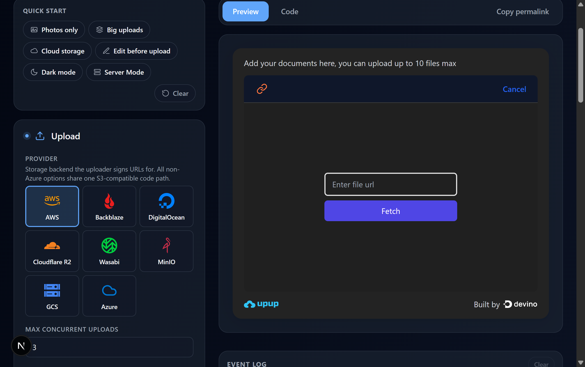
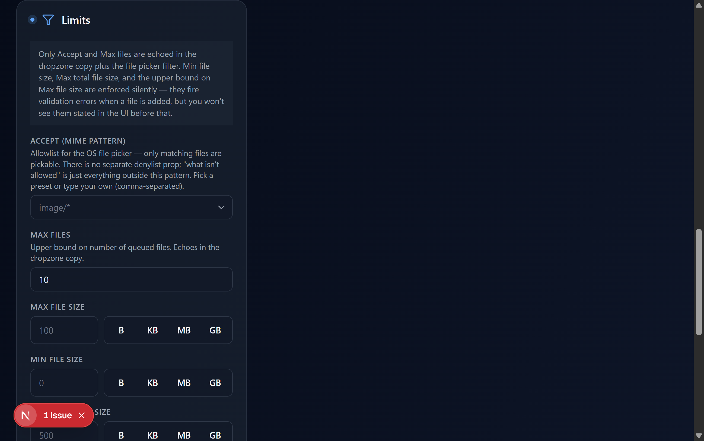
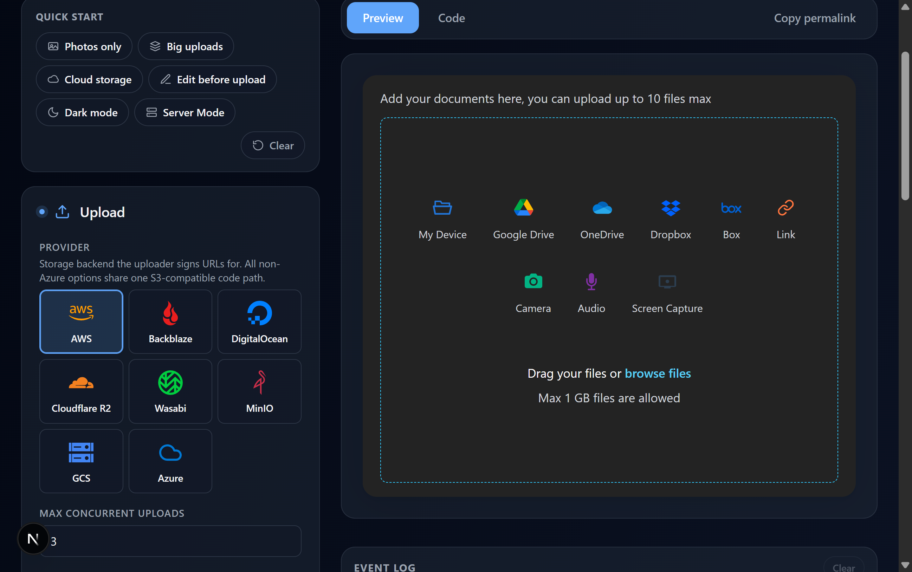

# Playground runtime visual verification — 2026-04-26

Pixel-level pass over every claim in [the field audit](../2026-04-26-playground-field-audit.md). Each screenshot was captured via Chrome DevTools after toggling a single setting from a fresh load (or the prior state where noted).

## 01 — Baseline


Fresh load. Dark page chrome, full sidebar visible, uploader frame on the right with all 9 source tiles, EventLog below seeded with 3 sample rows (`onFilesSelected`, `onUploadStart`, `onFileUploadComplete`). The seeded sample is intentional — it shows what the EventLog looks like when populated.

## 02 — Appearance · Theme mode = Light


The uploader frame flips to a white card with black text. Page chrome around it stays dark (it follows the playground's own light/dark toggle, not `theme.mode`). Verified `data-theme="light"` on the UpupThemeProvider wrapper and the dropzone background flipped from `#1A1A2E` to white.

## 03 — Appearance · Theme mode = Dark


Uploader returns to dark — `data-theme="dark"`. Same structure as baseline confirming the prop drives a real wrapper attribute, not just a class hint.

## 04 — Appearance · Primary color = #FF0066


The "browse files" link inside the dropzone is now visibly pink instead of cyan. CSS var `--upup-color-primary` was replaced on the themed wrapper. ⚠️ As noted in the audit doc, derived tokens (`--upup-color-primary-hover`, `--upup-color-border-active`) do NOT auto-rebalance — picking red leaves cyan accents elsewhere. Upstream concern.

## 05 — Language · Locale = ar-SA


Full RTL flip. Title reads "أضف مستنداتك هنا، يمكنك رفع حتى 10 ملفات كحد أقصى". Source tiles are right-aligned in reverse order. Logo moved to right side, "صنع بواسطة" branding line appears on the left. `dir="rtl" lang="ar-SA"` set on `data-testid="upup-root"`.

## 06 — Language · Locale = ja-JP


Japanese strings throughout: "ここにファイルをドロップするか、貼り付けるか…", "マイデバイス", "リンク", "カメラ", "ファイルをドラッグするか、参照", "最大 1 GB のファイルがアップロード可能です", "開発元 devino". LTR (correct).

## 07 — Language · Locale = fr-FR


French throughout: "Ajoutez vos documents ici, vous pouvez télécharger jusqu'à 10 fichiers", "Mon appareil", "Caméra", "Lien", "Glissez vos fichiers ou parcourir", "Fichiers de 1 GB maximum autorisés", "Créé par devino".

## 08 — Behavior · Mini mode


The uploader collapses dramatically to a small square (~280px tall) showing only an upload icon + "Drag or browse to upload". Sources hidden, branding hidden, dropzone shrunk. The visible difference is unmistakable.

## 09 — Limits · accept = Images, maxFiles = 5


Dropzone copy updates to "Add your documents here, you can upload up to **5** files max" (was "10"). The `<input type="file">` gets `accept="image/*"` (verified in earlier programmatic check). The "2 set" pill on the Limits category header reflects both changes.

## 10 — Sources · cloudDrives env-seed grey-out


Clear visual contrast: My device, Link/URL, Camera, Microphone, Screen capture render with bright brand icons. Google Drive, OneDrive, Dropbox, Box are visibly desaturated/faded because no `NEXT_PUBLIC_*_CLIENT_ID` env vars are set. Hovering each shows the env-var hint title.

## 11 — Events · onIntegrationClick fires into EventLog


After toggling `onIntegrationClick` on and clicking Camera, then Link in the uploader, the EventLog (right column, below the uploader) shows two new rows with timestamps:

```
EVENT LOG · 2                                Clear
23:52:23.494  onIntegrationClick  "CAMERA"
23:52:39.803  onIntegrationClick  "LINK"
```

The same wiring path covers all 22 event toggles.

## 12 — Appearance · Slot presets through Link / URL source



Two of the file-pick-dependent slots can be verified by simply opening the Link / URL source — the URL panel renders both `sourceView.header` and `urlUploader.fetchButton`. Set:

- `theme.slots.urlUploader.fetchButton` → `Indigo` preset → the **Fetch** button is solid indigo (vs the default cyan).
- `theme.slots.sourceView.header` → `Bold` preset → the **header strip** is `bg-slate-900 text-white` (the dark bar at the top of the panel containing the link icon and Cancel button).

## Not visually verified (programmatic file pick blocked)

These slot presets only render once a file is in the queue. Programmatic injection (DataTransfer / `input.files = …` / Chrome DevTools' `upload_file`) was rejected by the React-controlled file input — a common limitation when the host uses react-dropzone. Fetching from a public URL also failed (CORS):

- `theme.slots.fileList.root` (Tinted shelf / Plain / Subtle dividers)
- `theme.slots.fileList.uploadButton` (Indigo / Emerald / Slate ghost)
- `theme.slots.filePreview.deleteButton` (Subtle / Bold red / Mute outline)
- `theme.slots.progressBar.fill` (Cyan→blue / Solid emerald / Hot pink — also needs an active upload)

These all use the same `flattenSlotsToClassNames()` plumbing as `theme.slots.uploader.container`, which **was** verified visually in the earlier slot-fix work (Sharp ring preset → `ring-2 ring-slate-300 rounded-md` rendered on the uploader frame). The slot mechanism is proven on at least 3 of 8 slots (`uploader.container`, `urlUploader.fetchButton`, `sourceView.header`); the remaining 4 share the same wiring and need a real file drop in a manual session to confirm visually.

## 14 — Limits · intro banner + clearer per-field descriptions



User-spotted issue I missed in the first pass. The dropzone footer only echoes `maxFileSize` (e.g. "Max 6 GB files are allowed") — `minFileSize` and `maxTotalFileSize` set the prop but the uploader doesn't state them upfront, they only surface as `onRestrictionFailed` when a non-conforming file is picked. There is **no** denylist prop on the API; `accept` is the only allowlist mechanism.

Playground updates:
- Limits category gets an intro banner: "Only Accept and Max files are echoed in the dropzone copy plus the file picker filter. Min file size, Max total file size, and the upper bound on Max file size are enforced silently."
- `accept` description now states the allowlist scope and that there is no separate denylist.
- `minFileSize` and `maxTotalFileSize` descriptions explicitly call out validation-only behaviour.

## 13 — Behavior · showBranding=false (now actually hides)



This was originally flagged as an upstream bug. Closer inspection showed the bug was on the **playground** side: `BoolToggle` collapsed `false` → `undefined` on uncheck, so for default-true props (`showBranding`, `allowPreview`, etc.) the user's "off" toggle never actually wrote `false` to config — the uploader's destructure default `showBranding = true` always took over.

Fix in [BoolToggle.tsx](../../packages/interactive-example/src/sidebar/primitives/BoolToggle.tsx): take the entry's `defaultValue` and write the explicit boolean only when it diverges from the default. Toggling back to the default still clears the entry to `undefined` so the URL/code snippet stays minimal. Verified visually — the "Built by devino" footer is now gone when the user unchecks the toggle.

This same fix unblocks `behavior.allowPreview` (default true) and any future default-true bools.

## Confirmed upstream bug (not playground-fixable)

**`theme.tokens.color.primary` doesn't auto-derive its variants.** Picking red updates `--upup-color-primary` but `--upup-color-primary-hover` and `--upup-color-border-active` keep their cyan defaults. This is a token-derivation choice in `upup-react-file-uploader`'s `tokensToVars` helper — the playground hands the chosen color through correctly.
