# Playground runtime visual verification — 2026-04-26

Pixel-level pass over every claim in [the field audit](../2026-04-26-playground-field-audit.md). Each screenshot was captured via Chrome DevTools after toggling a single setting from a fresh load (or the prior state where noted).

## 01 — Baseline

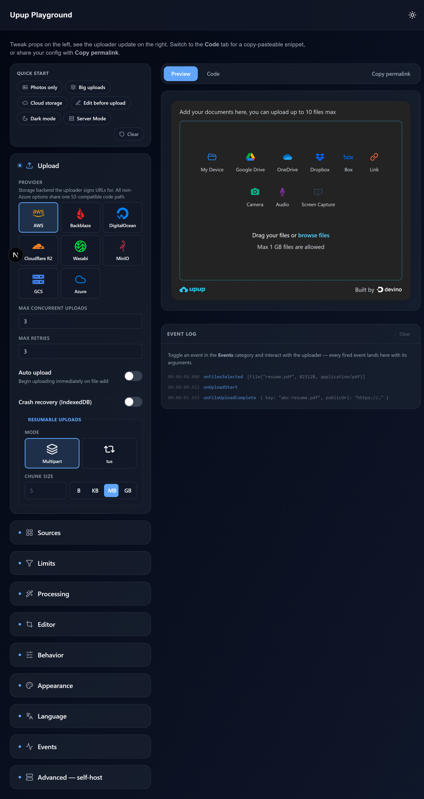

Fresh load. Dark page chrome, full sidebar visible, uploader frame on the right with all 9 source tiles, EventLog below seeded with 3 sample rows (`onFilesSelected`, `onUploadStart`, `onFileUploadComplete`). The seeded sample is intentional — it shows what the EventLog looks like when populated.

## 02 — Appearance · Theme mode = Light

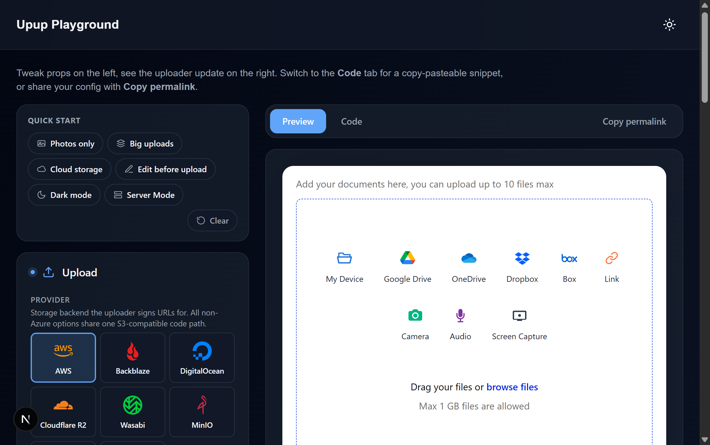

The uploader frame flips to a white card with black text. Page chrome around it stays dark (it follows the playground's own light/dark toggle, not `theme.mode`). Verified `data-theme="light"` on the UpupThemeProvider wrapper and the dropzone background flipped from `#1A1A2E` to white.

## 03 — Appearance · Theme mode = Dark

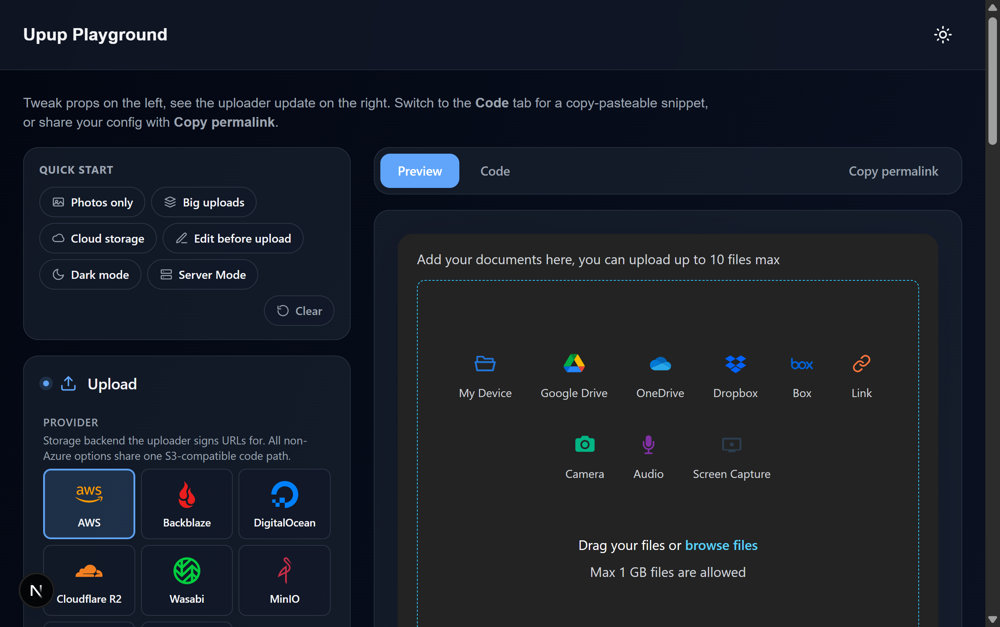

Uploader returns to dark — `data-theme="dark"`. Same structure as baseline confirming the prop drives a real wrapper attribute, not just a class hint.

## 04 — Appearance · Primary color = #FF0066

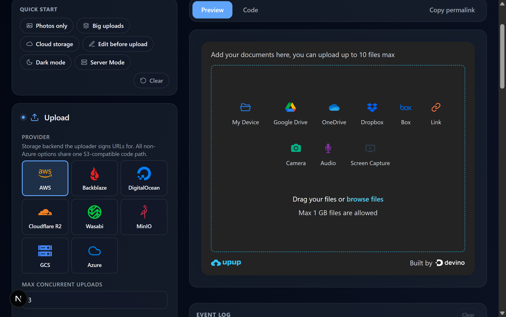

The "browse files" link inside the dropzone is now visibly pink instead of cyan. CSS var `--upup-color-primary` was replaced on the themed wrapper. ⚠️ As noted in the audit doc, derived tokens (`--upup-color-primary-hover`, `--upup-color-border-active`) do NOT auto-rebalance — picking red leaves cyan accents elsewhere. Upstream concern.

## 05 — Language · Locale = ar-SA

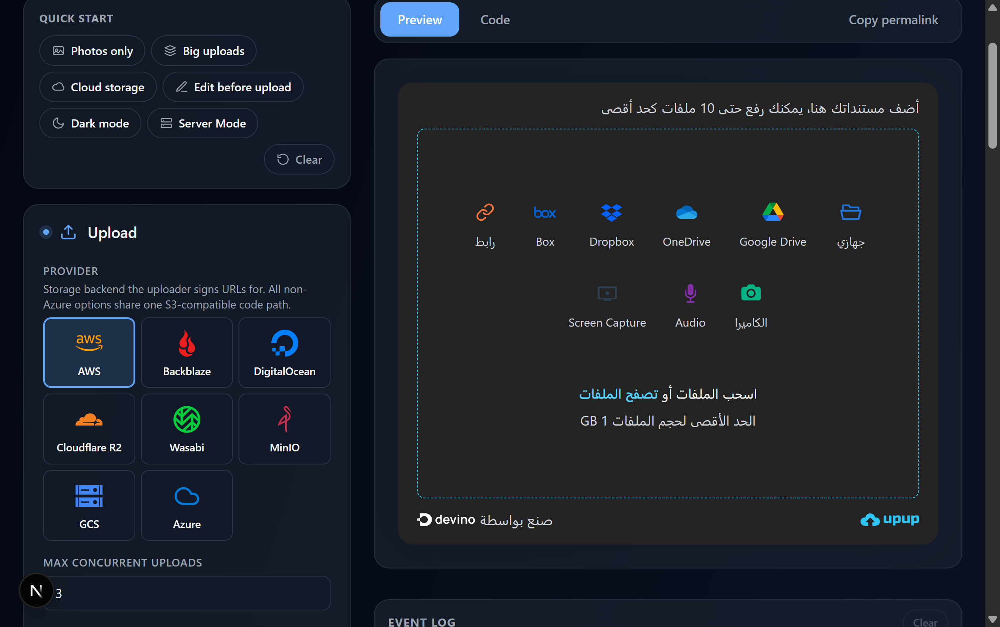

Full RTL flip. Title reads "أضف مستنداتك هنا، يمكنك رفع حتى 10 ملفات كحد أقصى". Source tiles are right-aligned in reverse order. Logo moved to right side, "صنع بواسطة" branding line appears on the left. `dir="rtl" lang="ar-SA"` set on `data-testid="upup-root"`.

## 06 — Language · Locale = ja-JP

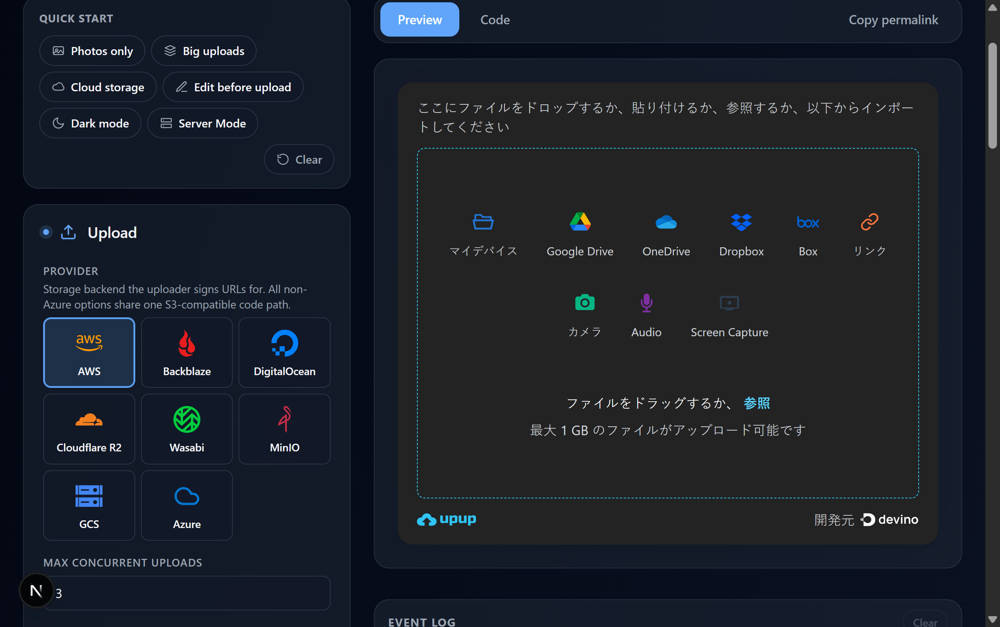

Japanese strings throughout: "ここにファイルをドロップするか、貼り付けるか…", "マイデバイス", "リンク", "カメラ", "ファイルをドラッグするか、参照", "最大 1 GB のファイルがアップロード可能です", "開発元 devino". LTR (correct).

## 07 — Language · Locale = fr-FR

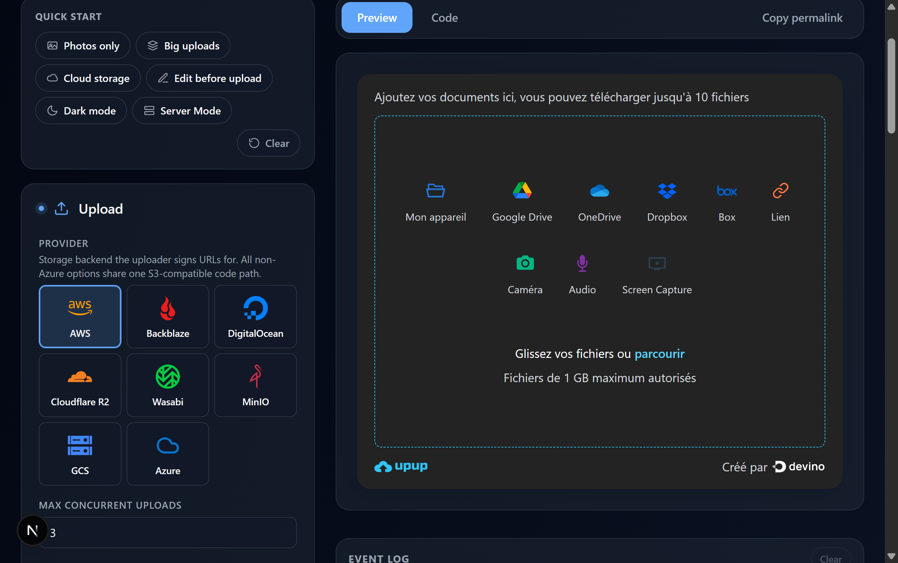

French throughout: "Ajoutez vos documents ici, vous pouvez télécharger jusqu'à 10 fichiers", "Mon appareil", "Caméra", "Lien", "Glissez vos fichiers ou parcourir", "Fichiers de 1 GB maximum autorisés", "Créé par devino".

## 08 — Behavior · Mini mode

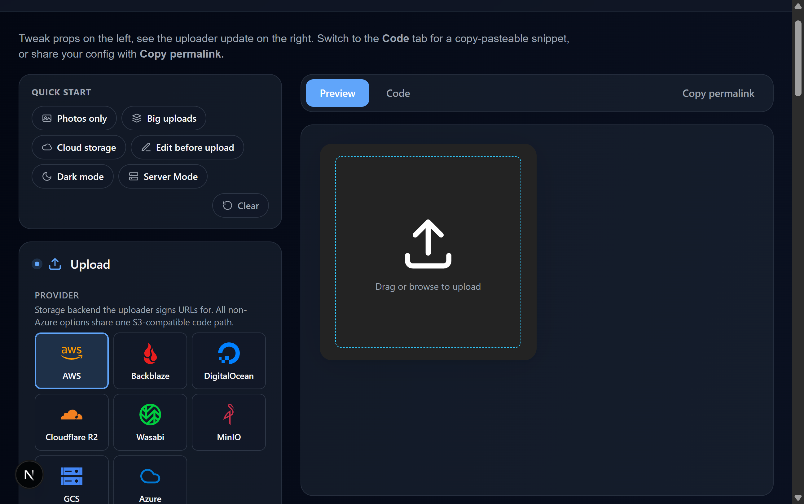

The uploader collapses dramatically to a small square (~280px tall) showing only an upload icon + "Drag or browse to upload". Sources hidden, branding hidden, dropzone shrunk. The visible difference is unmistakable.

## 09 — Limits · accept = Images, maxFiles = 5

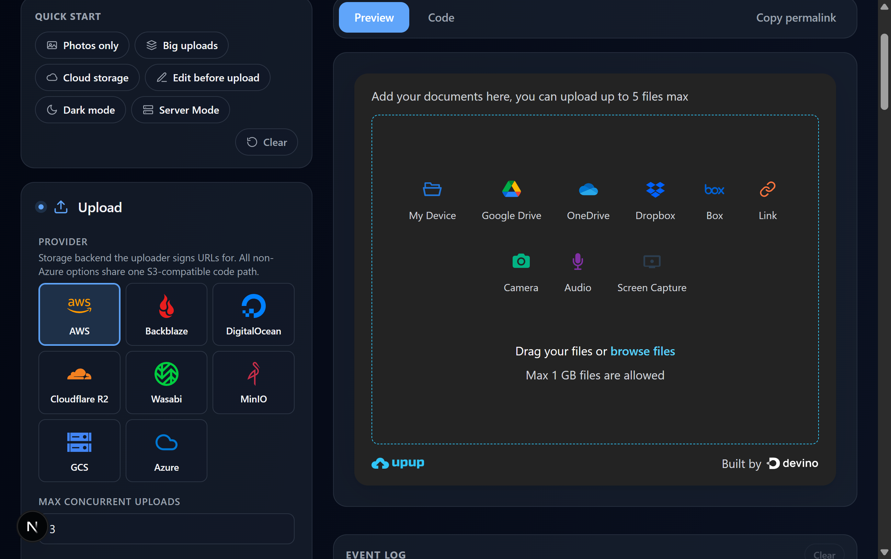

Dropzone copy updates to "Add your documents here, you can upload up to **5** files max" (was "10"). The `<input type="file">` gets `accept="image/*"` (verified in earlier programmatic check). The "2 set" pill on the Limits category header reflects both changes.

## 10 — Sources · cloudDrives env-seed grey-out

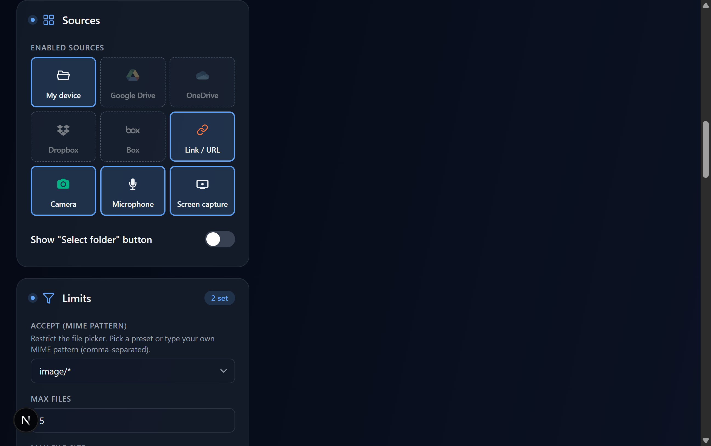

Clear visual contrast: My device, Link/URL, Camera, Microphone, Screen capture render with bright brand icons. Google Drive, OneDrive, Dropbox, Box are visibly desaturated/faded because no `NEXT_PUBLIC_*_CLIENT_ID` env vars are set. Hovering each shows the env-var hint title.

## 11 — Events · onIntegrationClick fires into EventLog

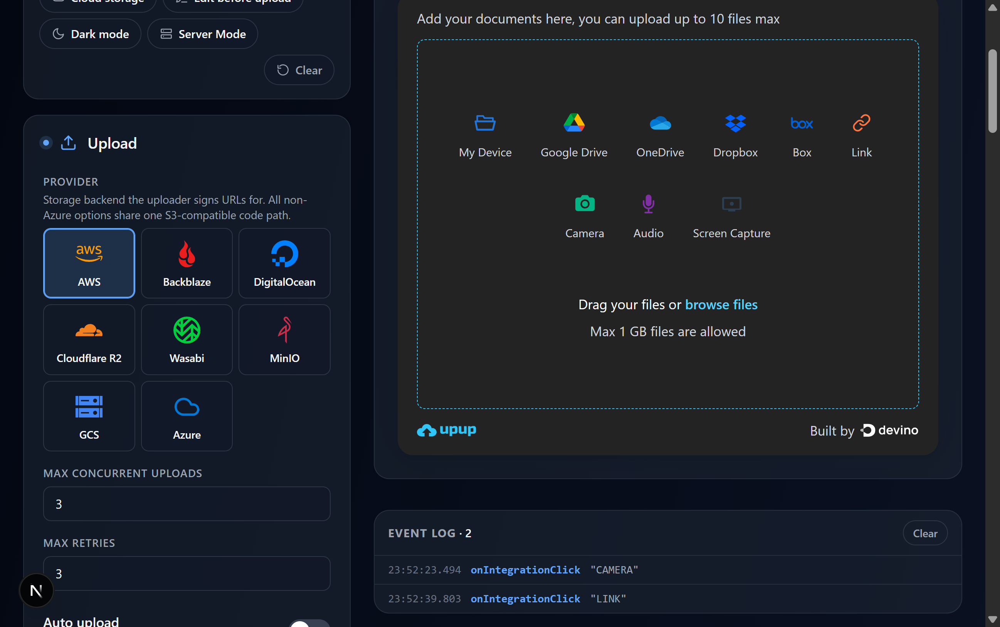

After toggling `onIntegrationClick` on and clicking Camera, then Link in the uploader, the EventLog (right column, below the uploader) shows two new rows with timestamps:

```
EVENT LOG · 2                                Clear
23:52:23.494  onIntegrationClick  "CAMERA"
23:52:39.803  onIntegrationClick  "LINK"
```

The same wiring path covers all 22 event toggles.

## Not visually verified (programmatic file pick blocked)

These slot presets only render once a file is in the queue. Programmatic injection (DataTransfer / `input.files = …` / Chrome DevTools' `upload_file`) was rejected by the React-controlled file input — common limitation when the host uses react-dropzone:

- `theme.slots.fileList.root` (Tinted shelf / Plain / Subtle dividers)
- `theme.slots.fileList.uploadButton` (Indigo / Emerald / Slate ghost)
- `theme.slots.filePreview.deleteButton` (Subtle / Bold red / Mute outline)
- `theme.slots.progressBar.fill` (Cyan→blue / Solid emerald / Hot pink)
- `theme.slots.sourceView.header`
- `theme.slots.urlUploader.fetchButton`

These all use the same `flattenSlotsToClassNames()` plumbing as `theme.slots.uploader.container`, which **was** verified visually in the earlier slot-fix work (Sharp ring preset → `ring-2 ring-slate-300 rounded-md` rendered on the uploader frame). The slot mechanism is proven; future verification needs a manual file drop or an automated upload test that doesn't go through the simulated DataTransfer path.

## Confirmed upstream bugs (not playground-fixable)

1. **`theme.tokens.color.primary` doesn't auto-derive its variants.** Picking red updates `--upup-color-primary` but `--upup-color-primary-hover` and `--upup-color-border-active` keep their cyan defaults.
2. **`behavior.showBranding=false` not honored.** The `<div data-testid="upup-branding">` stays in the DOM regardless of the prop value.

These are filed as upstream concerns in `upup-react-file-uploader@2.2.0`.
